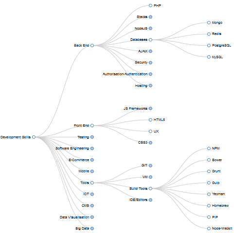

## Synopsis
 
A D3.js collapsible tree displaying the technologies and tools that I use with Web development

Based on [Mike Bostocks Collapsible Tree](http://bl.ocks.org/mbostock/4339083)

In index.html if you uncomment the JS file: 
<pre> js/radial-tree.js </pre>

A radial tree will be displayed.

## Installation

* Clone the Repository
* Click on index.html

## Screen Shots

		

		

Michael Cullen
2014
